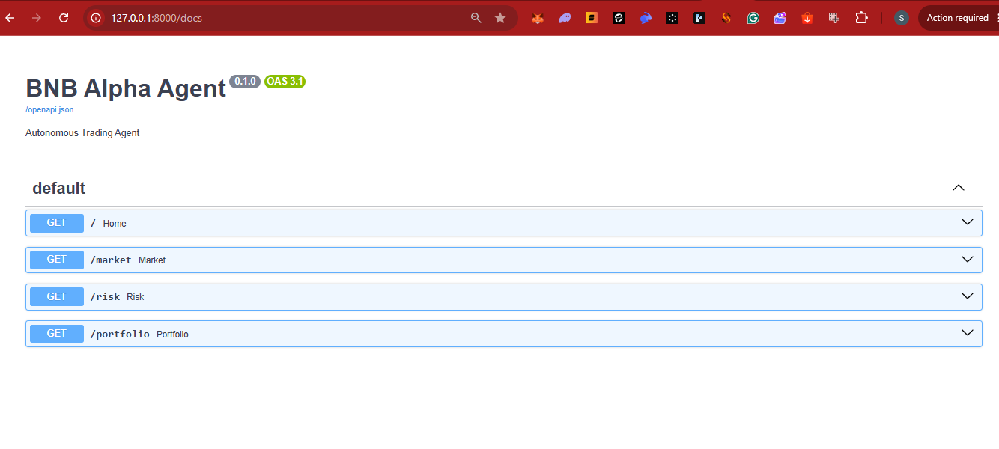
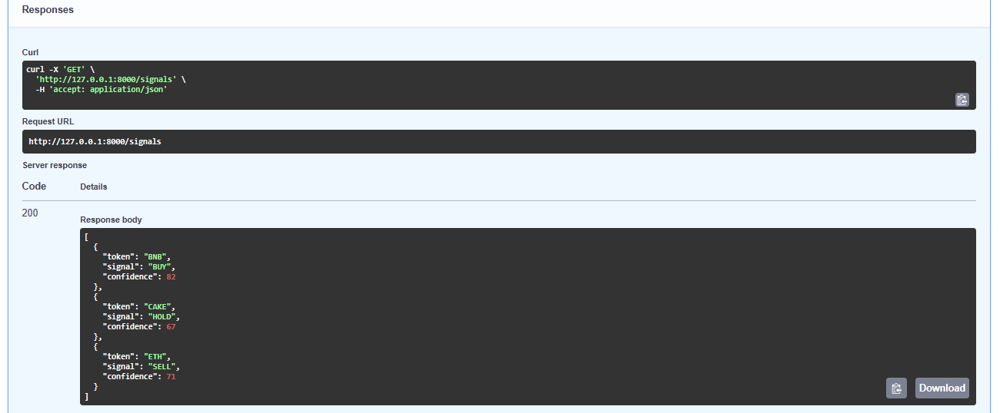

# BNB Alpha Agent

Autonomous Trading Agent built on BNB Chain.

## Overview

BNB Alpha Agent is a lightweight autonomous trading agent prototype that provides market signals, risk assessment, portfolio monitoring, and agent status APIs through a FastAPI backend.

## Screenshots

### Swagger UI



### Trading Signals API



## Features

* Market Signal Generation
* Risk Management
* Portfolio Monitoring
* Agent Health Monitoring
* Multi-Token Signal Support
* FastAPI Backend with Swagger UI

## Architecture

FastAPI Backend
↓
Market Data Layer
↓
Signal Engine
↓
Risk Manager
↓
Portfolio Monitor
↓
Autonomous Agent

## API Endpoints

| Endpoint       | Description                 |
| -------------- | --------------------------- |
| GET /          | Project status              |
| GET /market    | Market signal               |
| GET /risk      | Risk assessment             |
| GET /portfolio | Portfolio monitoring        |
| GET /signals   | Multi-token trading signals |
| GET /health    | Service health check        |
| GET /agent     | Agent status                |

## Run Locally

```bash
pip install -r requirements.txt

python -m uvicorn app:app --reload
```

Swagger UI:

```text
http://127.0.0.1:8000/docs
```

## Roadmap

### Phase 1

* Market monitoring
* Risk scoring
* Portfolio tracking

### Phase 2

* AI signal generation
* Multi-token analysis
* Strategy evaluation

### Phase 3

* Autonomous execution
* On-chain integration
* Real-time alerts
