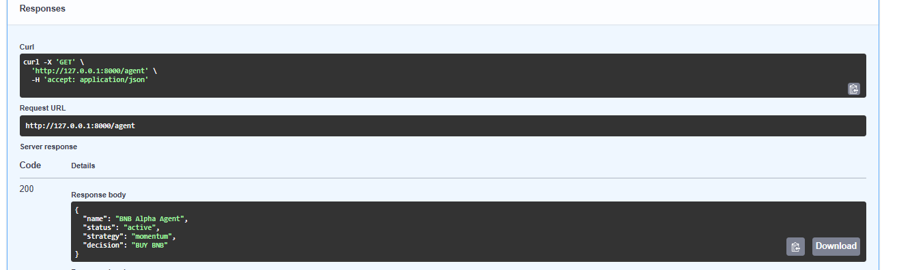

# BNB Alpha Agent

Autonomous Trading Agent built on BNB Chain.

## Overview

BNB Alpha Agent is a lightweight autonomous trading agent prototype designed for the BNB Chain ecosystem.

The project provides market signal generation, risk assessment, portfolio monitoring, and autonomous agent management through a FastAPI backend. It demonstrates how structured trading signals and risk evaluation can support trading decisions in a simple and extensible architecture.

---

## Screenshots

### Swagger UI


### Trading Signals API


### Agent Status API



---

## Features

* Market Signal API
* Multi-Token Trading Signals
* Risk Assessment API
* Portfolio Monitoring API
* Agent Status API
* Version Management API
* Signal Timestamp Tracking
* Agent Metadata Monitoring
* FastAPI Backend with Swagger UI

---

## Architecture

```text
FastAPI Backend
      ↓
Market Data Layer
      ↓
Signal Engine
      ↓
Risk Manager
      ↓
Portfolio Monitor
      ↓
Autonomous Agent
```

---

## API Endpoints

| Endpoint       | Description                 |
| -------------- | --------------------------- |
| GET /          | Project status              |
| GET /market    | Market signal               |
| GET /risk      | Risk assessment             |
| GET /portfolio | Portfolio monitoring        |
| GET /signals   | Multi-token trading signals |
| GET /health    | Service health check        |
| GET /agent     | Agent status                |
| GET /version   | Project version information |

---

## API Examples

### GET /signals

```json
{
  "timestamp": "2026-06-12T16:36:39+00:00",
  "signals": [
    {
      "token": "BNB",
      "signal": "BUY",
      "confidence": 82
    },
    {
      "token": "CAKE",
      "signal": "HOLD",
      "confidence": 67
    },
    {
      "token": "ETH",
      "signal": "SELL",
      "confidence": 71
    }
  ]
}
```

### GET /agent

```json
{
  "name": "BNB Alpha Agent",
  "status": "active",
  "strategy": "momentum",
  "decision": "BUY BNB",
  "updated_at": "2026-06-12T16:37:27+00:00"
}
```

### GET /version

```json
{
  "project": "BNB Alpha Agent",
  "version": "0.1.0",
  "release": "MVP"
}
```

---

## Run Locally

```bash
pip install -r requirements.txt

python -m uvicorn app:app --reload
```

### Swagger UI

```text
http://127.0.0.1:8000/docs
```

---

## Roadmap

### Phase 1

* Market monitoring
* Risk scoring
* Portfolio tracking

### Phase 2

* AI signal generation
* Multi-token analysis
* Strategy evaluation

### Phase 3

* Autonomous execution
* On-chain integration
* Real-time alerts

---

## Repository Structure

```text
BNB-Alpha-Agent/
│
├── docs/
│   ├── roadmap.md
│   └── architecture.md
│
├── screenshots/
│
├── submission/
│
├── app.py
├── requirements.txt
├── README.md
└── .gitignore
```

---

## Release

Current Release: **v0.1.0 – BNB Alpha Agent MVP**

Additional Updates:

* Signal timestamp support
* Enhanced agent metadata
* Version endpoint

---

## License

MIT License
